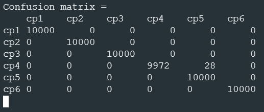

# Neural network: How to detect which axis is pointing up or down

This project was a part of a school project, where the goal was to determine the direction, which the accelerometer was pointing at any given time. The "AI" is pretty accurate even with slight movement (Figure 1).

 
*FIGURE 1. The confusion matrix created by nRF5340 using this model.*

In this repository, you may find an implemented and working K-means algorithm too. This page however, describes the neural network model used on the same device.

## Steps

THe following list describes the steps taken to achieve this working neural network. You can easily look through the code in this repository. Comments in the code may be in Finnish.

1. The data to teach the neural network was gathered from the accelerometer and provided with intended directions to the teaching algorithm.

2. The data was prepared with using a simple self-made algorithm, that substracted the middle from the x, y, and z coordinates. The intented purpose was to force one coordinate to 0, therefore easing the teaching process and later determination process.

    For example coordinates (1422, 1660, 1612), value 1612 would be substracted from these three creating new point (-190, 48, 0).

3. Neural network had only one hidden layer with 6 neurons. These neurons were the output neurons that determined the direction. The layer was activated with softmax function after operation. 3 input neurons describe the x, y and z coordinates. (Figure 2)

4. Optimizer used was adam, and the loss funtion used was binary crossentropy.

5. Model was trained maximum of 5 epochs, using batch size 30 and validation steps 10. Early stopping with patience 2 was used.

6. Model layer weights and biases were exported into C header and code files which were then included in the nordic's code.

7. Into nordic's code, dense, softmax and middle_point functions were implemented with C.

 
*FIGURE 2. Process of direction determination*

## Problems

There were multitude of problems during creation of this "AI" model. For a long time, the model did not learn at all and simply guessed the same direction over and over again. When preprocessing was introduced, the model started to recognize patterns more, but it was simply still terrible at understanding which direction the accelerometer was pointing. Softmax for the output was the best choice based on multiple trainings with multiple different activation functions.

One of the possible causes of problems were simply the simplicity of the data being processed. Coordinates in 3-dimentional plane are not very complicated.

## Future of this project

This project has been concluded and maintenance will not be provided. The code here exists only for the purpose of showing what has been done. The code is not perfect and might include redundancy.